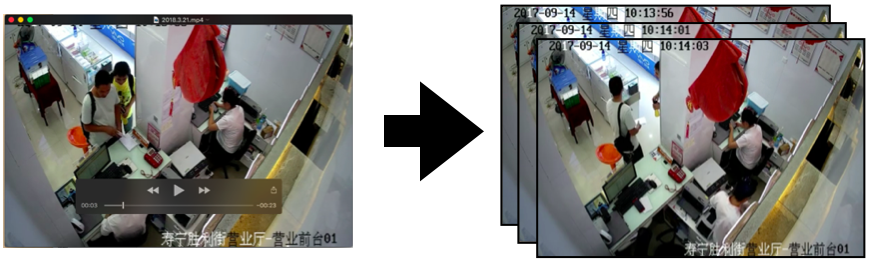
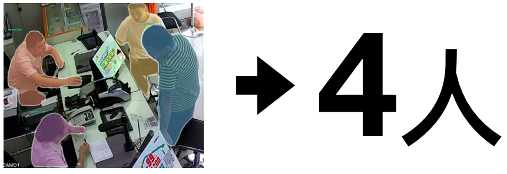
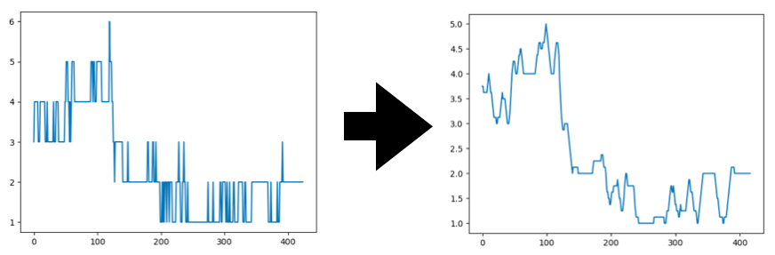
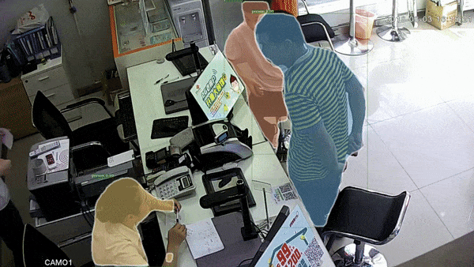
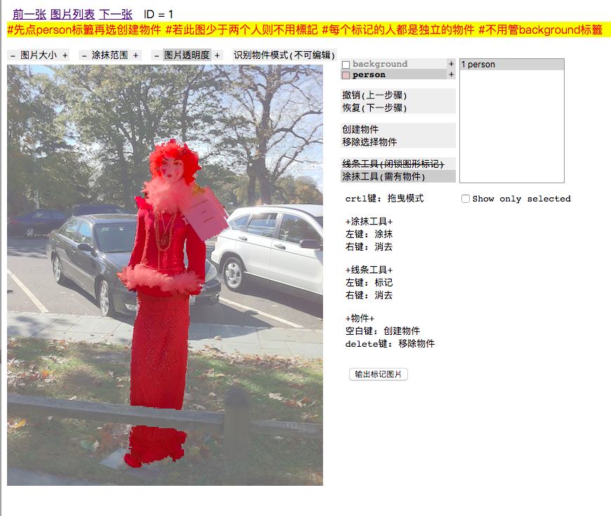

# 行人偵測與識別
## 里程碑
* [2017/12 - 2018/02] HOG - 范京(正职)
* [2018/02 - 2018/07] 維護交接 - 黄朝雅(正职)
* [2018/07 - 2018/08] Mask RCNN - 韓宏光(實習)、洪慕竹(实习)、黃傳恩(實習)

## 項目遭遇困難及克服辦法
|困難與瓶頸|目前解決方案|未來可行方案|
|---|---|---|
|聯通服務器系統版本落後，不支援GPU資源|我們使用學校GPU服務器自行開發|單個GPU服務器添購價約2萬刀|
|聯通服務器有連線限制，開通port需上繳大量文件|我們使用學校服務器自行實驗|自行添購服務器(或雲服務器)|
|外網限制連線，許多資源無法獲取|我們自行購買付費VPN獲取資源|自行購買VPN|
|無可用標記數據訓練|直接使用已訓練好的模型|計畫未來自行標註數據 - 須為[**coco**格式](https://blog.csdn.net/yeyang911/article/details/78675942)|
|無可用標記數據測試|肉眼感性評估|計畫未來自行標註數據 - 須為[**coco**格式](https://blog.csdn.net/yeyang911/article/details/78675942)，並採用[**mAP, mean Average Precision**](https://blog.csdn.net/katherine_hsr/article/details/79266880)標準評估效果|


## 項目前情提要與說明
此項目主要目標為透過解析營業廳監視視頻串流，統計並分析人流量。  
過去此項目的模型主要是基於HOG+SVM以識別行人，但此作法是2000年初較為落後的作法  
且HOG+SVM的效果並不是特別好，故改用深度學習框架及最新物體識別的算法嘗試解決此任務  
經大量搜尋及嘗試後，確定Facebook團隊開發的detectron開源項目效果為最好的  
因此直接採用該團隊使用GPU資源訓練好的模型及源代碼，後續進行項目適用化。

此項目大致流程如下：(點此閱讀[詳細流程文件](pages/main_procedure.md))
1. 自網上擷取視頻串流，並將視頻分割成圖像

2. 使用**行人偵測**模型(detectron)偵測圖像中的人數，(未來配合**人臉識別**與**行人再識別**，精確計算行人數量)

3. 平滑化數據(因模型存在失誤率)


## 項目進展
### **一、行人偵測** (見[流程文件](pages/main_procedure.md))


* **開源項目(detectron)**：(https://github.com/facebookresearch/Detectron)

> 若安裝caffe2(detectron使用環境)有困難，可改用tensorflow版本(效果略差)：(https://github.com/matterport/Mask_RCNN)

* **論文及相關閱讀**  
[1] RCNN, 2013: (https://arxiv.org/abs/1311.2524)  
[2] Spatial Pyramid, 2014: (https://arxiv.org/abs/1406.4729)  
[3] Fast RCNN, 2015: (https://arxiv.org/abs/1504.08083)  
[4] Faster RCNN, 2015: (https://arxiv.org/abs/1406.4729)  
[5] YOLO, 2015: (https://arxiv.org/abs/1506.02640)  
[6] Feature Pyramid, 2016: (https://arxiv.org/abs/1612.03144)  
[7] [Understanding Feature Pyramid Networks for object detection (FPN)](https://medium.com/@jonathan_hui/understanding-feature-pyramid-networks-for-object-detection-fpn-45b227b9106c)  
[8] Mask RCNN, 2017: (https://arxiv.org/abs/1703.06870)  
[9] [Instance Segmentation with Mask R-CNN and TensorFlow](https://engineering.matterport.com/splash-of-color-instance-segmentation-with-mask-r-cnn-and-tensorflow-7c761e238b46)  

* **平滑化數據**
> 由於模型並非完美，人肉眼看似差不多的圖像，模型很有可能第一張判斷有3個人，第二張則有4個人
> 為了降低此種"抖動"對結果產生的負面影響，我們採用[moving average](https://blog.csdn.net/u014365862/article/details/54380313)方式來處理

* **模型再訓練(適應營業廳場景)**
> 由于Facebook預先訓練好的模型對於人口密集的圖像仍不夠完善
> 我們計畫之後透過標記好的營業廳圖像來支持模型再訓練
> 模型再訓練主要的困難點如下：
> 1. 大量數據需人工標記
> 2. 需要GPU資源支持  
> 我們計畫以聯通服務器，架起標註訓練圖像的網站，供多人協力完成
> 
> Reference:  
> [1] Coco-style數據集創建: (https://patrickwasp.com/create-your-own-coco-style-dataset/)  
> [2] 修改Detectron配置文件: (https://zhuanlan.zhihu.com/p/34036460)  
> 
> 下圖為網站示意圖  
> 

1. 標記數據，並轉為coco格式(參考https://github.com/waspinator/js-segment-annotator)
```bash
$ git clone https://github.com/ken90242/js-segment-annotator.git

# 將所有待標註圖像移至js-segment-annotator/data/images/
# 直接打開網頁即可開始標註(請參考網頁說明)
# 標註完後點擊輸出即可獲得標註圖像(全黑的.png圖像檔案，名稱須為[編號].jpg)
# 將所有輸出的.png圖像(上千至上萬張)傳至js-segment-annotator/data/annotations

$ cd js-segment-annotator/python

# 輸出coco格式的json檔：位置為js-segment-annotator/data/coco.json
$ python generate_coco_json.py
```
2. 將標記數據及圖像移至detectron套件要求位置(見[detectron/detectron/datasets/data/README.md](https://github.com/facebookresearch/Detectron/blob/master/detectron/datasets/data/README.md))
```bash
# [Example] DETECTRON=/home/r06725053/detectron
$ DETECTRON=[detectron位置]

$ mkdir -p $DETECTRON/detectron/datasets/data/coco

# [Example]
# [原始圖像位置]: js-segment-annotator/data/images/
# [coco格式的標記檔位置]: js-segment-annotator/data/coco.json
$ ln -s [原始圖像位置] $DETECTRON/detectron/datasets/data/coco/
$ ln -s [coco格式的標記檔位置] $DETECTRON/detectron/datasets/data/coco/annotations
```

3. 修改detectron配置文件 - detectron/configs/12_2017_baselines/e2e_mask_rcnn_R-101-FPN_2x.yaml
> 這邊要注意NUM_GPUS要改為實際擁有的GPU數量

```diff
@@ 6,7 @@
+ # 訓練用的GPU數量
- NUM_GPUS: 8
+ NUM_GPUS: 2

@@ 11, 11 @@
+ # 模型初始學習速度(Learning Rate)
- BASE_LR: 0.005
+ BASE_LR: 0.02

@@ 33, 34 @@
+ # 模型權重檔案
- WEIGHTS: https://s3-us-west-2.amazonaws.com/detectron/ImageNetPretrained/MSRA/R-101.pkl
+ WEIGHTS: https://s3-us-west-2.amazonaws.com/detectron/35861858/12_2017_baselines/e2e_mask_rcnn_R-101-FPN_2x.yaml.02_32_51.SgT4y1cO/output/train/coco_2014_train:coco_2014_valminusminival/generalized_rcnn/model_final.pkl
+ # 數據集來源
- DATASETS: ('coco_2014_train', 'coco_2014_valminusminival')
+ DATASETS: ('coco_2014_train', 'self_train')

@@ 39, 38 @@
+ # 每次取圖片的數量
+ IMS_PER_BATCH: 1
```
4. 修改detectron訓練數據文件 - detectron/detectron/datasets/dataset_catalog.py
```diff
@@ 40, 0 @@
+ # 數據集的目錄位置
+ 'self_train': {
+ 	  _IM_DIR:
+        _DATA_DIR + '/coco/images',
+    _ANN_FN:
+        _DATA_DIR + '/coco/annotations/coco.json'
+ },
```
---

### 二、人臉識別

目前僅找到可用的開源項目，未進行實驗及任何優化，也未建立人臉資料庫  

* **開源項目(tiny-face)**：https://github.com/cydonia999/Tiny_Faces_in_Tensorflow

* **論文及相關閱讀**  
[1] Tiny Faces, 2016: (https://arxiv.org/abs/1612.04402)

---

### 三、行人再偵測(person re-identification)
分析多個圖像(監視視頻)，辨識同一個行人的特徵。尚待研究。
