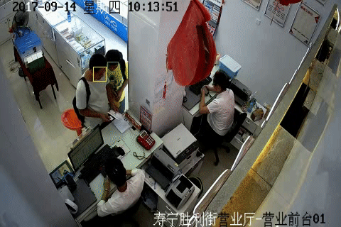

# 行人侦测与识别
## 里程碑
* [2017/12 - 2018/02] HOG - 范京(正职)
* [2018/02 - 2018/07] 维护交接 - 黄朝雅(正职)
* [2018/07 - 2018/08] Mask RCNN - 韩宏光(实习)、洪慕竹(实习)、黄传恩(实习)

## 项目遭遇困难及克服办法
* 联通服务器系统版本落后，不支援GPU资源(我们使用学校GPU服务器自行开发)
* 联通服务器有连线限制，开通port需上缴大量文件(我们使用学校服务器自行实验)
* 外网限制连线，许多资源无法获取(我们自行使用付费VPN获取资源)
* 无可​​用标记数据训练(我们直接使用已训练好的模型，计画未来自行标注数据 - 须为coco格式)
* 无可​​用标记数据测试(目前肉眼感性评估)

## 项目前情提要与说明
此项目主要目标为透过解析营业厅监视视频串流，统计并分析人流量。
过去此项目的模型主要是基于HOG+SVM以识别行人，但此作法是2000年初较为落后的作法
且HOG+SVM的效果并不是特别好，故改用深度学习框架及最新物体识别的算法尝试解决此任务
经大量搜寻及尝试后，确定Facebook团队开发的detectron开源项目效果为最好的
因此直接采用该团队使用GPU资源训练好的模型及源代码，后续进行项目适用化。

此项目大致流程如下：(点此阅读[详细流程文件](pages/main_procedure.md))
1. 自网上撷取视频串流，并将视频分割成图像

2. 使用**行人侦测**模型(detectron)侦测图像中的人数，(未来配合**人脸识别**与**行人再识别**，精确计算行人数量)

3. 平滑化数据(因模型存在失误率)


## 项目进展
### **一、行人侦测** (见[流程文件](pages/main_procedure.md))


* **开源项目(detectron)**：(https://github.com/facebookresearch/Detectron)

> 若安装caffe2(detectron使用环境)有困难，可改用tensorflow版本(效果略差)：(https://github.com/matterport/Mask_RCNN)

* **论文及相关阅读**
[1] RCNN, 2013: (https://arxiv.org/abs/1311.2524)
[2] Spatial Pyramid, 2014: (https://arxiv.org/abs/1406.4729)
[3] Fast RCNN, 2015: (https://arxiv.org/abs/1504.08083)
[4] Faster RCNN, 2015: (https://arxiv.org/abs/1406.4729)
[5] YOLO, 2015: (https://arxiv.org/abs/1506.02640)
[6] Mask RCNN, 2017: (https://arxiv.org/abs/1703.06870)
[7] [Instance Segmentation with Mask R-CNN and TensorFlow](https://engineering.matterport.com/splash-of-color-instance-segmentation-with-mask-r-cnn-and-tensorflow-7c761e238b46)
[8] Feature Pyramid, 2016: (https://arxiv.org/abs/1612.03144)
[9] [Understanding Feature Pyramid Networks for object detection (FPN)](https://medium.com/@jonathan_hui/understanding-feature-pyramid-networks-for-object-detection-fpn-45b227b9106c)

* **模型再训练(适应营业厅场景)**
> 由于Facebook预先训练好的模型对于人口密集的图像仍不够完善
> 我们计画之后透过标记好的营业厅图像来支持模型再训练
> 模型再训练主要的困难点如下：
> 1. 大量数据需人工标记
> 2. 需要GPU资源支持
> 我们计画以联通服务器，架起标注训练图像的网站，供多人协力完成
>
> Reference:
> [1] Coco-style数据集创建: (https://patrickwasp.com/create-your-own-coco-style-dataset/)
> [2] 修改Detectron配置文件: (https://zhuanlan.zhihu.com/p/34036460)
>
> 下图为网站示意图
> 

1. 标记数据，并转为coco格式(参考https://github.com/waspinator/js-segment-annotator)
```bash
git clone https://github.com/ken90242/js-segment-annotator.git

# 将所有待标注图像移至js-segment-annotator/data/images/
# 直接打开网页即可开始标注(请参考网页说明)
# 标注完后点击输出即可获得标注图像(全黑的.png图像档案，名称须为[编号].jpg)
# 将所有输出的.png图像(上千至上万张)传至js-segment-annotator/data/annotations

cd js-segment-annotator/python

# 输出coco格式的json档：位置为js-segment-annotator/data/coco.json
python generate_coco_json.py
```
2. 将标记数据及图像移至detectron套件要求位置(见[detectron/detectron/datasets/data/README.md](https://github.com/facebookresearch/Detectron/blob/master/detectron/datasets/ data/README.md))
```bash
# [Example] DETECTRON=/home/r06725053/detectron
DETECTRON=[detectron位置]

mkdir -p $DETECTRON/detectron/datasets/data/coco

# [Example]
# [原始图像位置]: js-segment-annotator/data/images/
# [coco格式的标记档位置]: js-segment-annotator/data/coco.json
ln -s [原始图像位置] $DETECTRON/detectron/datasets/data/coco/
ln -s [coco格式的标记档位置] $DETECTRON/detectron/datasets/data/coco/annotations
```

3. 修改detectron配置文件 - detectron/configs/12_2017_baselines/e2e_mask_rcnn_R-101-FPN_2x.yaml
> 这边要注意NUM_GPUS要改为实际拥有的GPU数量

```diff
@@ 6,7 @@
- NUM_GPUS: 8
+ NUM_GPUS: 2

@@ 11, 11 @@
- BASE_LR: 0.005
+ BASE_LR: 0.02

@@ 33, 34 @@
- WEIGHTS: https://s3-us-west-2.amazonaws.com/detectron/ImageNetPretrained/MSRA/R-101.pkl
+ WEIGHTS: https://s3-us-west-2.amazonaws.com/detectron/35861858/12_2017_baselines/e2e_mask_rcnn_R-101-FPN_2x.yaml.02_32_51.SgT4y1cO/output/train/coco_2014_train:coco_2014_valminusminival/generalized_rcnn/model_final.pkl
- DATASETS: ('coco_2014_train', 'coco_2014_valminusminival')
+ DATASETS: ('coco_2014_train', 'self_train')

@@ 39, 38 @@
+ IMS_PER_BATCH: 1
```
[4. 修改detectron训练数据文件 - detectron/detectron/datasets/dataset_catalog.py]
```diff
@@ 40, 0 @@
+ 'self_train': {
+ _IM_DIR:
+ _DATA_DIR + '/coco/images',
+ _ANN_FN:
+ _DATA_DIR + '/coco/annotations/coco.json'
+ },
```
---

### 二、人脸识别

目前仅找到可用的开源项目，未进行实验及任何优化，也未建立人脸资料库

* **开源项目(tiny-face)**：https://github.com/cydonia999/Tiny_Faces_in_Tensorflow

* **论文及相关阅读**
[1] Tiny Faces, 2016: (https://arxiv.org/abs/1612.04402)

---

### 三、行人再侦测(person re-identification)
分析多个图像(监视视频)，辨识同一个行人的特征。尚待研究。